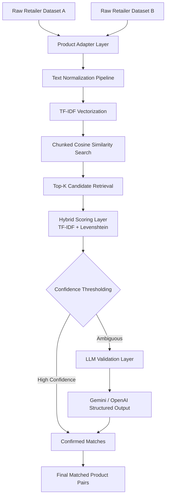

# 🛒 Cross-Retailer Product Matching Engine

A production-style **entity resolution system** that matches equivalent grocery products across heterogeneous retailer catalogs (Costco vs Superstore-style datasets).

The system combines:
- NLP-based vector retrieval (TF-IDF)
- fuzzy string matching (Levenshtein)
- heuristic scoring
- LLM-based validation (Gemini / OpenAI)

to resolve noisy, inconsistent product naming across datasets.

---

# ⚙️ System Architecture

---
# 📊 Results

On a large-scale evaluation (~285K vs ~55K product catalog comparison), the system produced:

- ~8,600+ high-confidence matches (from ~10K candidate alignments)
- ~99% precision observed on manually validated samples and cross-validation using multiple LLMs (GPT, Gemini)

The pipeline demonstrated strong performance in identifying equivalent products across highly noisy and heterogeneous retail datasets.
